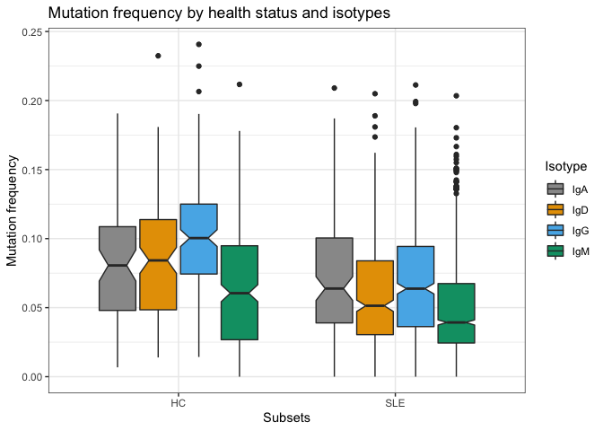
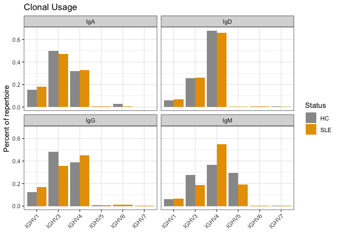
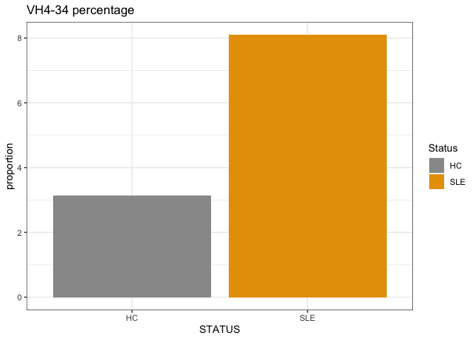
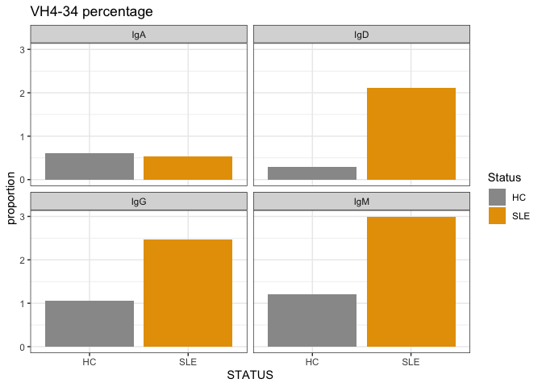
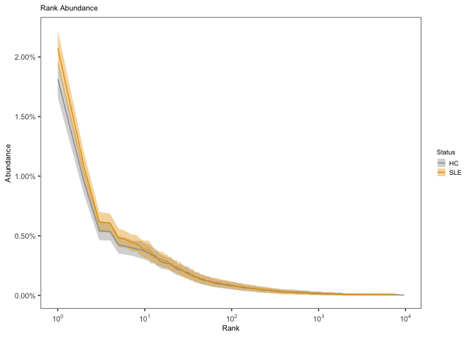
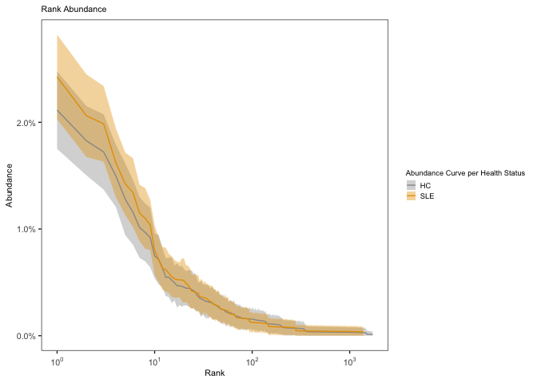
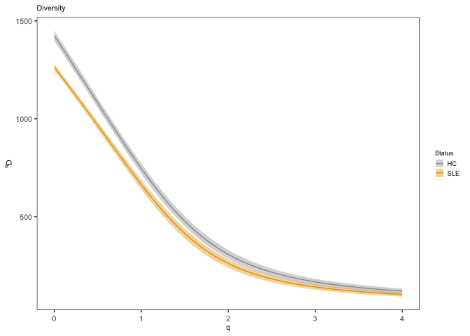
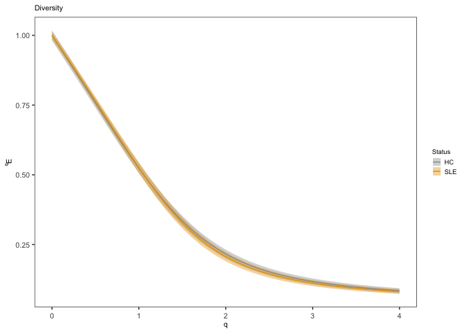

Tipton 2015 Analysis part2
================
William Guesdon
Compiled: February 29, 2020

``` r
################
# Load libraries
################

library(tidyverse)
library(alakazam)
library(shazam)
library(cowplot)
library(rstatix)
library(cowplot)
library(ggpubr)
```

For the first part of the analysis see: Tipton\_2015\_analysis\_part1\_v01-01.Rmd

-   Data processing with ChangeO
-   Clonal threshold analysis

Load Changeo processed table
============================

``` r
directory <- "/Users/william/Documents/GitHub/GitHub_Data/Tipton_2015_SLE_vs_HC/Immcantation/all_samples/"
file <- dir(directory, pattern = "*.tab")
```

``` r
all_samples <- readChangeoDb(paste0(directory, file[1]))
saveRDS(all_samples, "Output/R_object/all_samples_post_threshold.RDS")
```

``` r
#glimpse(all_samples)
```

Plot sequecens for each isotype
===============================

``` r
db <- all_samples
```

Add isotypes See sequences in the papers

``` r
# db <- db  %>%
#   mutate(ISOTYPE = 
#            ifelse(str_detect(SEQUENCE_INPUT, fixed('GGGAGTGCATCCGCCCC', ignore_case=TRUE)), "IgM",
#            ifelse(str_detect(SEQUENCE_INPUT, fixed('GCACCCACCAAGGCTCC', ignore_case=TRUE)), "IgD",
#            ifelse(str_detect(SEQUENCE_INPUT, fixed('GCATCCCCGACCAGCCC', ignore_case=TRUE)), "IgA",
#            ifelse(str_detect(SEQUENCE_INPUT, fixed('GCCTCCACCAAGGGCCC', ignore_case=TRUE)), "IgG",
#            ifelse(str_detect(SEQUENCE_INPUT, fixed('GCTTCCACCAAGGGCCC', ignore_case=TRUE)), "IgG",
#            ifelse(str_detect(SEQUENCE_INPUT, fixed('GCCTCCACACAGAGCCC', ignore_case=TRUE)), "IgE", NA
#            ))))))
#          )
```

``` r
# db <- db  %>%
#   mutate(ISOTYPE =
#            ifelse(str_detect(SEQUENCE_INPUT, fixed('CCTTTTCCCCCTCGTCTCCTG', ignore_case=TRUE)), "IgM",
#            ifelse(str_detect(SEQUENCE_INPUT, fixed('GCACCCACCAAGGCTCC', ignore_case=TRUE)), "IgD",
#            ifelse(str_detect(SEQUENCE_INPUT, fixed('CGACCAGCCCCAAGGTCTTC', ignore_case=TRUE)), "IgA",
#            ifelse(str_detect(SEQUENCE_INPUT, fixed('TCCACCAAGGGCCCATCGG', ignore_case=TRUE)), "IgG",
#            ifelse(str_detect(SEQUENCE_INPUT, fixed('GCCTCCACACAGAGCCC', ignore_case=TRUE)), "IgE", NA
#            )))))
#          )
```

Issue with determining the isotype. Try to reduce the signature in case the problem is linked to shorted read. The issue is that some isotype could be not be correctly identified.

``` r
db <- db  %>%
  mutate(ISOTYPE =
           ifelse(str_detect(SEQUENCE_INPUT, fixed('GGGAGT', ignore_case=TRUE)), "IgM",
           ifelse(str_detect(SEQUENCE_INPUT, fixed('GCACCC', ignore_case=TRUE)), "IgD",
           ifelse(str_detect(SEQUENCE_INPUT, fixed('GCATCC', ignore_case=TRUE)), "IgA",
           ifelse(str_detect(SEQUENCE_INPUT, fixed('GCCTCC', ignore_case=TRUE)), "IgG",
           ifelse(str_detect(SEQUENCE_INPUT, fixed('GCTTCC', ignore_case=TRUE)), "IgG",
           ifelse(str_detect(SEQUENCE_INPUT, fixed('GCCTCC', ignore_case=TRUE)), "IgE", NA
           ))))))
         )
all_samples_isotype <- db
```

``` r
nrow(db)
```

    ## [1] 86790

``` r
db <- db  %>%
    filter(!is.na(ISOTYPE)) %>%
    filter(!is.na(D_CALL))
nrow(db)
```

    ## [1] 25568

``` r
#View(db)
```

Compare HC vs SLE IgM sequences
===============================

``` r
db %>% 
    group_by(STATUS, ISOTYPE) %>%
    count() %>%
    knitr::kable()
```

| STATUS | ISOTYPE |     n|
|:-------|:--------|-----:|
| HC     | IgA     |   404|
| HC     | IgD     |  1349|
| HC     | IgG     |  2237|
| HC     | IgM     |  5398|
| SLE    | IgA     |   628|
| SLE    | IgD     |  2192|
| SLE    | IgG     |  3884|
| SLE    | IgM     |  9476|

``` r
directory <- "/Users/william/Documents/GitHub/Tipton_2015_analysis/Output/"
title <- 'Isotype count per health status'
file <- paste0(directory,title,'.png')

bar <- ggplot(db)+
        aes(x = STATUS, fill = ISOTYPE) +
        geom_bar(position = PositionDodge, color='black') +
        theme_bw() +
        scale_fill_manual(name="Isotype", values=cbPalette)+
        ggtitle(title)

plot(bar)
```


``` r
ggsave(bar, filename = file)
```

``` r
db_HC <- db %>%
    filter(STATUS == "HC")

db_SLE <- db %>%
    filter(STATUS == "SLE")

HC <- ggplot(db_HC)+
        aes(x = DONOR, fill = ISOTYPE) +
        geom_bar(position = "fill", color='black') +
        theme_bw() +
        scale_fill_manual(name="Isotype", values=cbPalette)+
        ggtitle('Isotype count healthy control subjects')

SLE <- ggplot(db_SLE)+
        aes(x = DONOR, fill = ISOTYPE) +
        geom_bar(position = "fill", color='black') +
        theme_bw() +
        scale_fill_manual(name="Isotype", values=cbPalette)+
        ggtitle('Isotype count SLE patients')

plot(HC)
```


``` r
ggsave(HC, filename = paste0(directory, 'Isotype count healthy control subjects' ,'.png'))
```

    ## Saving 7 x 5 in image

``` r
plot(SLE)
```


``` r
ggsave(SLE, filename = paste0(directory, 'Isotype count SLE patients' ,'.png'))
```

    ## Saving 7 x 5 in image

Mutation analysis
=================

``` r
#see 10X_Got_IGH_analysis_v01-02
# Collapse clone for analysis
db <- collapseClones(db, cloneColumn = "CLONE",
                      sequenceColumn = "SEQUENCE_IMGT",
                      germlineColumn = "GERMLINE_IMGT_D_MASK", muFreqColumn = NULL,
                      regionDefinition = NULL, method = c("mostCommon", "thresholdedFreq",
                                                          "catchAll", "mostMutated", "leastMutated"), minimumFrequency = NULL,
                      includeAmbiguous = FALSE, breakTiesStochastic = FALSE,
                      breakTiesByColumns = NULL, expandedDb = FALSE, nproc = 1)

# Calculate combined R and S mutation frequencies
db_obs <- observedMutations(db, sequenceColumn="SEQUENCE_IMGT",
                            germlineColumn="GERMLINE_IMGT_D_MASK",
                            regionDefinition=NULL,
                            frequency=TRUE, 
                            combine=TRUE,
                            nproc=1)
```

``` r
# Plot mutation frequencies per subsets and isotypes
title <- "Mutation frequency by health status and isotypes"
file <- paste0('Output/',title,'.png')

boxplot <- ggplot(db_obs, aes(x=STATUS, y=MU_FREQ, fill=ISOTYPE)) +
  theme_bw() +
  ggtitle(title)+
  xlab("Subsets") + ylab("Mutation frequency") +
  scale_fill_manual(name="Isotype", values=cbPalette) +
  geom_boxplot(notch = TRUE, varwidth = FALSE)

plot(boxplot)
```



``` r
ggsave(boxplot, filename = file)

stat <- aov(MU_FREQ ~ STATUS, data = db_obs)  %>% 
    tukey_hsd() %>% 
    mutate(variable = "MU_FREQ") %>% 
    select(variable, group1, group2, p.adj, p.adj.signif) %>% 
    arrange(p.adj)
write_csv(stat, "Output/MU_FREQ_stat.csv")
#knitr::kable(stat) 
```

Physico-chemical properties analysis
====================================

``` r
db_props <- aminoAcidProperties(db_obs, seq="JUNCTION", nt=TRUE, trim=TRUE, 
                                label="CDR3")
db_props_copy <- db_props
```

``` r
db_props_summary <- db_props %>%
    group_by(STATUS, ISOTYPE) %>%
    select(
        STATUS,
        ISOTYPE,
        CDR3_AA_LENGTH,
        CDR3_AA_GRAVY,
        CDR3_AA_BASIC,
        CDR3_AA_ACIDIC,
        CDR3_AA_AROMATIC,
        CDR3_AA_ALIPHATIC,
        CDR3_AA_POLARITY
    )
write_csv(db_props_summary, "Output/db_props_summary.csv")
#View(db_props_summary)
```

``` r
#https://stackoverflow.com/questions/29678435/how-to-pass-dynamic-column-names-in-dplyr-into-custom-function
# https://stackoverflow.com/questions/29678435/how-to-pass-dynamic-column-names-in-dplyr-into-custom-function
# https://stackoverflow.com/questions/38511743/adding-missing-grouping-variables-message-in-dplyr-in-r

#View(db_props)

selected_variables <- c("MU_FREQ", "CDR3_AA_LENGTH", "CDR3_AA_GRAVY", "CDR3_AA_BASIC", "CDR3_AA_ACIDIC", "CDR3_AA_AROMATIC", "CDR3_AA_ALIPHATIC", "CDR3_AA_POLARITY")

for (i in selected_variables){
#print(i)
g1 <- db_props  %>%
    select(STATUS, ISOTYPE, !!as.name(i)) %>%
    group_by(STATUS, ISOTYPE) %>%
    summarise(
    mean = mean(!!as.name(i)),
    se = sd(!!as.name(i))/sqrt(n())) %>%
    ggplot( aes(x=STATUS, y=mean, fill = STATUS))+
    geom_bar(stat="identity",
           colour="black",
           position=position_dodge(0.9)) +
  geom_errorbar(aes(ymin = mean - se, ymax = mean + se), 
                position=position_dodge(0.9), width = 0.2)+
        scale_fill_manual(name="STATUS", values=cbPalette, guide=FALSE) +
        theme(text = element_text(size=20))+
        ylab(i)+
        tmp_theme +
        facet_wrap( .~ ISOTYPE)

ggsave(g1, filename = paste0("Output/", i, ".png"))
#plot(g1)
}


db_props <- db_props_copy %>% filter(ISOTYPE == "IgM")    
for (i in selected_variables){
#print(i)
g1 <- db_props  %>%
    select(STATUS, ISOTYPE, !!as.name(i)) %>%
    group_by(STATUS) %>%
    summarise(
    mean = mean(!!as.name(i)),
    se = sd(!!as.name(i))/sqrt(n())) %>%
    ggplot( aes(x=STATUS, y=mean, fill = STATUS))+
    geom_bar(stat="identity",
           colour="black",
           position=position_dodge(0.9)) +
  geom_errorbar(aes(ymin = mean - se, ymax = mean + se), 
                position=position_dodge(0.9), width = 0.2)+
        scale_fill_manual(name="STATUS", values=cbPalette, guide=FALSE) +
        theme(text = element_text(size=20))+
        ylab(i)+
        tmp_theme

ggsave(g1, filename = paste0("Output/IgM/", i, ".png"))
#plot(g1)
}

db_props <- db_props_copy %>% filter(ISOTYPE == "IgD")    
for (i in selected_variables){
#print(i)
g1 <- db_props  %>%
    select(STATUS, ISOTYPE, !!as.name(i)) %>%
    group_by(STATUS) %>%
    summarise(
    mean = mean(!!as.name(i)),
    se = sd(!!as.name(i))/sqrt(n())) %>%
    ggplot( aes(x=STATUS, y=mean, fill = STATUS))+
    geom_bar(stat="identity",
           colour="black",
           position=position_dodge(0.9)) +
  geom_errorbar(aes(ymin = mean - se, ymax = mean + se), 
                position=position_dodge(0.9), width = 0.2)+
        scale_fill_manual(name="STATUS", values=cbPalette, guide=FALSE) +
        theme(text = element_text(size=20))+
        ylab(i)+
        tmp_theme

ggsave(g1, filename = paste0("Output/IgD/", i, ".png"))
#plot(g1)
}

db_props <- db_props_copy %>% filter(ISOTYPE == "IgG")    
for (i in selected_variables){
#print(i)
g1 <- db_props  %>%
    select(STATUS, ISOTYPE, !!as.name(i)) %>%
    group_by(STATUS) %>%
    summarise(
    mean = mean(!!as.name(i)),
    se = sd(!!as.name(i))/sqrt(n())) %>%
    ggplot( aes(x=STATUS, y=mean, fill = STATUS))+
    geom_bar(stat="identity",
           colour="black",
           position=position_dodge(0.9)) +
  geom_errorbar(aes(ymin = mean - se, ymax = mean + se), 
                position=position_dodge(0.9), width = 0.2)+
        scale_fill_manual(name="STATUS", values=cbPalette, guide=FALSE) +
        theme(text = element_text(size=20))+
        ylab(i)+
        tmp_theme

ggsave(g1, filename = paste0("Output/IgG/", i, ".png"))
#plot(g1)
}

db_props <- db_props_copy %>% filter(ISOTYPE == "IgA")    
for (i in selected_variables){
#print(i)
g1 <- db_props  %>%
    select(STATUS, ISOTYPE, !!as.name(i)) %>%
    group_by(STATUS) %>%
    summarise(
    mean = mean(!!as.name(i)),
    se = sd(!!as.name(i))/sqrt(n())) %>%
    ggplot( aes(x=STATUS, y=mean, fill = STATUS))+
    geom_bar(stat="identity",
           colour="black",
           position=position_dodge(0.9)) +
  geom_errorbar(aes(ymin = mean - se, ymax = mean + se), 
                position=position_dodge(0.9), width = 0.2)+
        scale_fill_manual(name="STATUS", values=cbPalette, guide=FALSE) +
        theme(text = element_text(size=20))+
        ylab(i)+
        tmp_theme

ggsave(g1, filename = paste0("Output/IgA/", i, ".png"))
#plot(g1)
}
```

Compare V gene usage between HC and SLE
=======================================

``` r
# D1D2_IGH_analysis_v01-01
# Quantify V family clonal usage by sample and isotype
db_props <- db_props_copy

family <- countGenes(db_props, gene="V_CALL", groups=c("STATUS", "ISOTYPE"), clone="CLONE", mode="family")

family_plot <- ggplot(family, aes(x=GENE, y=CLONE_FREQ, fill = STATUS)) +
  tmp_theme +
  ggtitle("Clonal Usage") +
  theme(axis.text.x=element_text(angle=45, hjust=1, vjust=1)) +
  ylab("Percent of repertoire") +
  xlab("") +
  #scale_y_continuous() +
  #scale_colour_manual(values=cbPalette)+
  #scale_color_brewer(palette="Set1") +
  #geom_point(aes(color=SUBSET), size=5, alpha=0.8) +
  geom_col(position=position_dodge(0.9)) +
  scale_fill_manual(name="Status", values=cbPalette)+
  facet_wrap( .~ ISOTYPE)

plot(family_plot)
```



``` r
ggsave(family_plot, filename = "Output/family_usage_by_ISO.png")

family_plot <- ggplot(family, aes(x=GENE, y=CLONE_FREQ, fill = STATUS)) +
  tmp_theme +
  ggtitle("Clonal Usage") +
  theme(axis.text.x=element_text(angle=45, hjust=1, vjust=1)) +
  ylab("Percent of repertoire") +
  xlab("") +
  #scale_y_continuous() +
  #scale_colour_manual(values=cbPalette)+
  #scale_color_brewer(palette="Set1") +
  #geom_point(aes(color=SUBSET), size=5, alpha=0.8) +
  geom_col(position=position_dodge(0.9)) +
  scale_fill_manual(name="Status", values=cbPalette)

plot(family_plot)
```


``` r
ggsave(family_plot, filename = "Output/family_usage_total.png")
```

Compare VH4-34 expression
=========================

``` r
db_props_copy %>% 
    group_by(STATUS, ISOTYPE) %>%
    count() %>%
    knitr::kable()
```

| STATUS | ISOTYPE |     n|
|:-------|:--------|-----:|
| HC     | IgA     |    72|
| HC     | IgD     |   121|
| HC     | IgG     |   172|
| HC     | IgM     |   302|
| SLE    | IgA     |   127|
| SLE    | IgD     |   423|
| SLE    | IgG     |   573|
| SLE    | IgM     |  1348|

``` r
iso_count <- db_props_copy %>% 
    group_by(STATUS, ISOTYPE) %>%
    summarise(
        count = n()
    )

iso_count %>%
    knitr::kable()
```

| STATUS | ISOTYPE |  count|
|:-------|:--------|------:|
| HC     | IgA     |     72|
| HC     | IgD     |    121|
| HC     | IgG     |    172|
| HC     | IgM     |    302|
| SLE    | IgA     |    127|
| SLE    | IgD     |    423|
| SLE    | IgG     |    573|
| SLE    | IgM     |   1348|

``` r
HC_IgA <- iso_count %>% 
    filter(STATUS == 'HC') %>%
    filter(ISOTYPE == 'IgA')
#HC_IgA$count

HC_IgD <- iso_count %>% 
    filter(STATUS == 'HC') %>%
    filter(ISOTYPE == 'IgD')
#HC_IgD$count

HC_IgG <- iso_count %>% 
    filter(STATUS == 'HC') %>%
    filter(ISOTYPE == 'IgG')
#HC_IgG$count

HC_IgM <- iso_count %>% 
    filter(STATUS == 'HC') %>%
    filter(ISOTYPE == 'IgM')
#HC_IgM$count

HC_total <- (HC_IgA$count + HC_IgD$count + HC_IgG$count + HC_IgM$count)

SLE_IgA <- iso_count %>% 
    filter(STATUS == 'SLE') %>%
    filter(ISOTYPE == 'IgA')
#SLE_IgA$count

SLE_IgD <- iso_count %>% 
    filter(STATUS == 'SLE') %>%
    filter(ISOTYPE == 'IgD')
#SLE_IgD$count

SLE_IgG <- iso_count %>% 
    filter(STATUS == 'SLE') %>%
    filter(ISOTYPE == 'IgG')
#SLE_IgG$count

SLE_IgM <- iso_count %>% 
    filter(STATUS == 'SLE') %>%
    filter(ISOTYPE == 'IgM')
#SLE_IgM$count

SLE_total <- (SLE_IgA$count + SLE_IgD$count + SLE_IgG$count + SLE_IgM$count)
```

``` r
db <- db_props_copy %>%
    select(STATUS, GERMLINE_V_CALL) %>%
    filter( str_detect(GERMLINE_V_CALL, "4-34")) %>%
    group_by(STATUS) %>%
    summarise(
        count = n()
    ) %>%
    mutate(
        proportion = 
            ifelse(STATUS == 'HC', count/HC_total*100,
            ifelse(STATUS == 'SLE', count/SLE_total*100, NA
                            ))
    )

    ggplot(db)+
    aes( x = STATUS, y = proportion, fill = STATUS) +
    geom_col()+
    scale_fill_manual(name="Status", values=cbPalette) +
    tmp_theme +
    ggtitle('VH4-34 percentage')
```



``` r
#View(db)
```

``` r
# db <- db_props_copy %>%
#     select(STATUS, GERMLINE_V_CALL, ISOTYPE) %>%
#     filter(str_detect(GERMLINE_V_CALL, "4-34")) %>%
#     filter(ISOTYPE == "IgM") %>%
#     group_by(STATUS) %>%
#     summarise(
#         count = n()
#     ) %>%
#     mutate(
#         proportion =
#             ifelse(STATUS == 'HC', count/HC_total*100,
#             ifelse(STATUS == 'SLE', count/SLE_total*100, NA
#                             ))
#     )
# 
#     ggplot(db)+
#     aes( x = STATUS, y = proportion, fill = STATUS) +
#     geom_col()+
#     scale_fill_manual(name="Status", values=cbPalette) +
#     tmp_theme +
#     ggtitle('VH4-34 percentage')
# 
#View(db)
```

``` r
db <- db_props_copy %>%
    select(STATUS, GERMLINE_V_CALL, ISOTYPE) %>%
    filter(str_detect(GERMLINE_V_CALL, "4-34")) %>%
    group_by(STATUS, ISOTYPE) %>%
    summarise(
        count = n()
    ) %>%
    mutate(
        proportion =
            ifelse(STATUS == 'HC', count/HC_total*100,
            ifelse(STATUS == 'SLE', count/SLE_total*100, NA
                            ))
    )

    ggplot(db)+
    aes( x = STATUS, y = proportion, fill = STATUS) +
    geom_col()+
    scale_fill_manual(name="Status", values=cbPalette) +
    tmp_theme +
    ggtitle('VH4-34 percentage') +
    facet_wrap( .~ ISOTYPE)
```



``` r
# #View(db)
```

Compare clonal diversity between HC and SLE
===========================================

clonal abundance curve
----------------------

``` r
db <- all_samples_isotype
# Partitions the data on the SAMPLE column
# Calculates a 95% confidence interval via 200 bootstrap realizations
curve <- estimateAbundance(db, group="STATUS", ci=0.95, nboot=200)
# Plots a rank abundance curve of the relative clonal abundances
sample_colors <- c("HC"="#999999", "SLE"="#E69F00")
plot(curve, colors = sample_colors, legend_title="Status")
```



Diversity curve
---------------

    ##  [1] 0.0 0.1 0.2 0.3 0.4 0.5 0.6 0.7 0.8 0.9 1.0 1.1 1.2 1.3 1.4 1.5 1.6 1.7 1.8
    ## [20] 1.9 2.0 2.1 2.2 2.3 2.4 2.5 2.6 2.7 2.8 2.9 3.0 3.1 3.2 3.3 3.4 3.5 3.6 3.7
    ## [39] 3.8 3.9 4.0

``` r
# Plot a log-log (log_q=TRUE, log_d=TRUE) plot of sample diversity
# Indicate number of sequences resampled from each group in the title
sample_main <- paste0("Sample diversity")
sample_colors <- c("HC"="#999999", "SLE"="#E69F00")
plot(sample_curve, colors=sample_colors, main_title=sample_main, 
     legend_title="STATUS")
```


Compare the diversity of the IgM heavy chains
---------------------------------------------

``` r
db <- all_samples_isotype %>%
    filter(ISOTYPE == "IgM")
# Compare diversity curve across values in the "STATUS" column
# q ranges from 0 (min_q=0) to 4 (max_q=4) in 0.05 incriments (step_q=0.05)
# A 95% confidence interval will be calculated (ci=0.95)
# 200 resampling realizations are performed (nboot=200)
sample_curve <- alphaDiversity(db, group="STATUS",
                               min_q=0, max_q=4, step_q=0.1,
                               ci=0.95, nboot=200)
```

    ##  [1] 0.0 0.1 0.2 0.3 0.4 0.5 0.6 0.7 0.8 0.9 1.0 1.1 1.2 1.3 1.4 1.5 1.6 1.7 1.8
    ## [20] 1.9 2.0 2.1 2.2 2.3 2.4 2.5 2.6 2.7 2.8 2.9 3.0 3.1 3.2 3.3 3.4 3.5 3.6 3.7
    ## [39] 3.8 3.9 4.0

``` r
# Plot a log-log (log_q=TRUE, log_d=TRUE) plot of sample diversity
# Indicate number of sequences resampled from each group in the title
sample_main <- paste0("IgM Diversity")
sample_colors <- c("HC"="#999999", "SLE"="#E69F00")
plot(sample_curve, colors=sample_colors, main_title=sample_main, 
     legend_title="STATUS")
```


``` r
# db <- all_samples_isotype %>%
#     filter(ISOTYPE == "IgD")
# # Compare diversity curve across values in the "STATUS" column
# # q ranges from 0 (min_q=0) to 4 (max_q=4) in 0.05 incriments (step_q=0.05)
# # A 95% confidence interval will be calculated (ci=0.95)
# # 200 resampling realizations are performed (nboot=200)
# sample_curve <- alphaDiversity(db, group="Status",
#                                min_q=0, max_q=4, step_q=0.1,
#                                ci=0.95, nboot=200)
```

``` r
# Plot a log-log (log_q=TRUE, log_d=TRUE) plot of sample diversity
# Indicate number of sequences resampled from each group in the title
sample_main <- paste0("IgD diversity")
sample_colors <- c("HC"="#999999", "SLE"="#E69F00")
plot(sample_curve, colors=sample_colors, main_title=sample_main, 
     legend_title="STATUS")
```


``` r
# Plot a log-log (log_q=TRUE, log_d=TRUE) plot of sample diversity
# Indicate number of sequences resampled from each group in the title
sample_main <- paste0("IgG diversity")
sample_colors <- c("HC"="#999999", "SLE"="#E69F00")
plot(sample_curve, colors=sample_colors, main_title=sample_main, 
     legend_title="STATUS")
```


``` r
# Plot a log-log (log_q=TRUE, log_d=TRUE) plot of sample diversity
# Indicate number of sequences resampled from each group in the title
sample_main <- paste0("IgA diversity")
sample_colors <- c("HC"="#999999", "SLE"="#E69F00")
plot(sample_curve, colors=sample_colors, main_title=sample_main, 
     legend_title="STATUS")
```


Abundance Curve
---------------

``` r
abund <- estimateAbundance(db, group="STATUS", nboot=100)
sample_colors <- c("HC"="#999999", "SLE"="#E69F00")
plotAbundanceCurve(abund, sample_colors, legend_title="Abundance Curve per Health Status")
```



Diversity Curve
---------------

``` r
# See https://alakazam.readthedocs.io/en/stable/topics/plotDiversityCurve/
div <- alphaDiversity(db, group = "STATUS", nboot=100)
```

    ##  [1] 0.0 0.1 0.2 0.3 0.4 0.5 0.6 0.7 0.8 0.9 1.0 1.1 1.2 1.3 1.4 1.5 1.6 1.7 1.8
    ## [20] 1.9 2.0 2.1 2.2 2.3 2.4 2.5 2.6 2.7 2.8 2.9 3.0 3.1 3.2 3.3 3.4 3.5 3.6 3.7
    ## [39] 3.8 3.9 4.0

``` r
plotDiversityCurve(div, sample_colors, legend_title="Status")
```



``` r
plotDiversityCurve(div, sample_colors, legend_title="Status", score="evenness")
```


