Determine factors influencing stroke
================
William Guesdon
2021/01/31

# Introduction

The goal of this assignment is to use statistical learning to identify
the combination of the features that are more likely to be associated
with stroke. For this analysis, I first performed an exploratory data
analysis and feature engineering. As often seen in health-related
datasets, the proportion of patients with stroke is low, resulting in a
severely unbalanced dataset. To compensate for the unbalance, I used the
ROSE package to artificially over sample the number of strokes
observations.  
I then used a dimension reduction technique adapted to mixed datasets of
continuous and categorical variables with the FAMD package. This
visualization allowed me to identify the features most likely associated
with the risk of developing a stroke. Using these selected variables, I
built a logistic regression model to evaluate the contribution of each
feature to the risk of developing a stroke. The logistic regression
model identified the Age, Average Glucose Level, Smoking, Hypertension,
and Heart Diseases features as the most likely risk factors of
developing a stroke. Age was the principal risk factor in this study.

[Dataset](https://www.kaggle.com/asaumya/healthcare-dataset-stroke-data),
downloaded on the 20200328

  - id: Patient ID
  - gender: Gender of Patient
  - age: Age of Patient
  - hypertension: 0 - no hypertension, 1 hypertension
  - heart-disease: 0 - no heart disease, 1 heart disease
  - ever\_married: Yes/No
  - work\_type: Type of occupation
  - Residence\_type: Are type of residence (Urban / Rural)
  - avg\_glucose\_level: Average Glucose level (measure after meal)
  - bmi: body mass index
  - smoking\_status: patient smoking status
  - Stoke: 0 - no stroke, 1 - suffered stroke

# Initialization

``` r
rm(list = ls()) # Erase variables from previous scripts
```

``` r
# Load libraries
library('tidyverse') # For Data Cleaning, EDA, Data Visualization
library('kableExtra') # To print table in report
library('ggsci') # For color palettes 
library('glue') # For improved print
library('DataExplorer') # For Exploratory Data Analysis
library('patchwork') # To easily plot multiple graphs
library('ROSE') # For oversampling
library('FactoMineR') # For PCA Analysis
library('factoextra') # For PCA Analysis
```

``` r
# Load the dataset
file_path <- file.path("Data", "train_2v.csv")
df <- read_csv(file = file_path)
```

# Environement and packages informations

``` r
glue('Operating System: macOS Mojave - 10.14.6')
```

    ## Operating System: macOS Mojave - 10.14.6

``` r
glue('{version$version.string}')
```

    ## R version 4.0.3 (2020-10-10)

``` r
glue('RStudio Version 1.1.383')
```

    ## RStudio Version 1.1.383

``` r
# Print the version of the essential packages used for the analysis
packages_list <- c('tidyverse', 'DataExplorer', 'FactoMineR', 'factoextra', 'patchwork', 'ROSE')

Name <- 'tidyverse'
Version <- getNamespaceVersion('tidyverse')

packages_informations <- tibble(Name, Version)

packages_list <- packages_list[2:length(packages_list)]
    
for(package in packages_list){
    Name <- package
    Version <- getNamespaceVersion(package)
    db <- tibble(Name, Version)
    packages_informations <- rbind(packages_informations, db)
}

packages_informations %>%
    arrange(Name) %>%
    knitr::kable() %>%
    kable_styling(bootstrap_options = "striped", full_width = F)
```

<table class="table table-striped" style="width: auto !important; margin-left: auto; margin-right: auto;">

<thead>

<tr>

<th style="text-align:left;">

Name

</th>

<th style="text-align:left;">

Version

</th>

</tr>

</thead>

<tbody>

<tr>

<td style="text-align:left;">

DataExplorer

</td>

<td style="text-align:left;">

0.8.2

</td>

</tr>

<tr>

<td style="text-align:left;">

factoextra

</td>

<td style="text-align:left;">

1.0.7

</td>

</tr>

<tr>

<td style="text-align:left;">

FactoMineR

</td>

<td style="text-align:left;">

2.4

</td>

</tr>

<tr>

<td style="text-align:left;">

patchwork

</td>

<td style="text-align:left;">

1.1.1

</td>

</tr>

<tr>

<td style="text-align:left;">

ROSE

</td>

<td style="text-align:left;">

0.0-3

</td>

</tr>

<tr>

<td style="text-align:left;">

tidyverse

</td>

<td style="text-align:left;">

1.3.0

</td>

</tr>

</tbody>

</table>

# Exploratory Data Analysis

## Check if the dataset is tidy

``` r
# glimpse(df)
```

``` r
df %>% 
    head(n=10) %>%
    knitr::kable() %>%
    kable_styling(bootstrap_options = "striped", full_width = F)
```

<table class="table table-striped" style="width: auto !important; margin-left: auto; margin-right: auto;">

<thead>

<tr>

<th style="text-align:right;">

id

</th>

<th style="text-align:left;">

gender

</th>

<th style="text-align:right;">

age

</th>

<th style="text-align:right;">

hypertension

</th>

<th style="text-align:right;">

heart\_disease

</th>

<th style="text-align:left;">

ever\_married

</th>

<th style="text-align:left;">

work\_type

</th>

<th style="text-align:left;">

Residence\_type

</th>

<th style="text-align:right;">

avg\_glucose\_level

</th>

<th style="text-align:right;">

bmi

</th>

<th style="text-align:left;">

smoking\_status

</th>

<th style="text-align:right;">

stroke

</th>

</tr>

</thead>

<tbody>

<tr>

<td style="text-align:right;">

30669

</td>

<td style="text-align:left;">

Male

</td>

<td style="text-align:right;">

3

</td>

<td style="text-align:right;">

0

</td>

<td style="text-align:right;">

0

</td>

<td style="text-align:left;">

No

</td>

<td style="text-align:left;">

children

</td>

<td style="text-align:left;">

Rural

</td>

<td style="text-align:right;">

95.12

</td>

<td style="text-align:right;">

18.0

</td>

<td style="text-align:left;">

NA

</td>

<td style="text-align:right;">

0

</td>

</tr>

<tr>

<td style="text-align:right;">

30468

</td>

<td style="text-align:left;">

Male

</td>

<td style="text-align:right;">

58

</td>

<td style="text-align:right;">

1

</td>

<td style="text-align:right;">

0

</td>

<td style="text-align:left;">

Yes

</td>

<td style="text-align:left;">

Private

</td>

<td style="text-align:left;">

Urban

</td>

<td style="text-align:right;">

87.96

</td>

<td style="text-align:right;">

39.2

</td>

<td style="text-align:left;">

never smoked

</td>

<td style="text-align:right;">

0

</td>

</tr>

<tr>

<td style="text-align:right;">

16523

</td>

<td style="text-align:left;">

Female

</td>

<td style="text-align:right;">

8

</td>

<td style="text-align:right;">

0

</td>

<td style="text-align:right;">

0

</td>

<td style="text-align:left;">

No

</td>

<td style="text-align:left;">

Private

</td>

<td style="text-align:left;">

Urban

</td>

<td style="text-align:right;">

110.89

</td>

<td style="text-align:right;">

17.6

</td>

<td style="text-align:left;">

NA

</td>

<td style="text-align:right;">

0

</td>

</tr>

<tr>

<td style="text-align:right;">

56543

</td>

<td style="text-align:left;">

Female

</td>

<td style="text-align:right;">

70

</td>

<td style="text-align:right;">

0

</td>

<td style="text-align:right;">

0

</td>

<td style="text-align:left;">

Yes

</td>

<td style="text-align:left;">

Private

</td>

<td style="text-align:left;">

Rural

</td>

<td style="text-align:right;">

69.04

</td>

<td style="text-align:right;">

35.9

</td>

<td style="text-align:left;">

formerly smoked

</td>

<td style="text-align:right;">

0

</td>

</tr>

<tr>

<td style="text-align:right;">

46136

</td>

<td style="text-align:left;">

Male

</td>

<td style="text-align:right;">

14

</td>

<td style="text-align:right;">

0

</td>

<td style="text-align:right;">

0

</td>

<td style="text-align:left;">

No

</td>

<td style="text-align:left;">

Never\_worked

</td>

<td style="text-align:left;">

Rural

</td>

<td style="text-align:right;">

161.28

</td>

<td style="text-align:right;">

19.1

</td>

<td style="text-align:left;">

NA

</td>

<td style="text-align:right;">

0

</td>

</tr>

<tr>

<td style="text-align:right;">

32257

</td>

<td style="text-align:left;">

Female

</td>

<td style="text-align:right;">

47

</td>

<td style="text-align:right;">

0

</td>

<td style="text-align:right;">

0

</td>

<td style="text-align:left;">

Yes

</td>

<td style="text-align:left;">

Private

</td>

<td style="text-align:left;">

Urban

</td>

<td style="text-align:right;">

210.95

</td>

<td style="text-align:right;">

50.1

</td>

<td style="text-align:left;">

NA

</td>

<td style="text-align:right;">

0

</td>

</tr>

<tr>

<td style="text-align:right;">

52800

</td>

<td style="text-align:left;">

Female

</td>

<td style="text-align:right;">

52

</td>

<td style="text-align:right;">

0

</td>

<td style="text-align:right;">

0

</td>

<td style="text-align:left;">

Yes

</td>

<td style="text-align:left;">

Private

</td>

<td style="text-align:left;">

Urban

</td>

<td style="text-align:right;">

77.59

</td>

<td style="text-align:right;">

17.7

</td>

<td style="text-align:left;">

formerly smoked

</td>

<td style="text-align:right;">

0

</td>

</tr>

<tr>

<td style="text-align:right;">

41413

</td>

<td style="text-align:left;">

Female

</td>

<td style="text-align:right;">

75

</td>

<td style="text-align:right;">

0

</td>

<td style="text-align:right;">

1

</td>

<td style="text-align:left;">

Yes

</td>

<td style="text-align:left;">

Self-employed

</td>

<td style="text-align:left;">

Rural

</td>

<td style="text-align:right;">

243.53

</td>

<td style="text-align:right;">

27.0

</td>

<td style="text-align:left;">

never smoked

</td>

<td style="text-align:right;">

0

</td>

</tr>

<tr>

<td style="text-align:right;">

15266

</td>

<td style="text-align:left;">

Female

</td>

<td style="text-align:right;">

32

</td>

<td style="text-align:right;">

0

</td>

<td style="text-align:right;">

0

</td>

<td style="text-align:left;">

Yes

</td>

<td style="text-align:left;">

Private

</td>

<td style="text-align:left;">

Rural

</td>

<td style="text-align:right;">

77.67

</td>

<td style="text-align:right;">

32.3

</td>

<td style="text-align:left;">

smokes

</td>

<td style="text-align:right;">

0

</td>

</tr>

<tr>

<td style="text-align:right;">

28674

</td>

<td style="text-align:left;">

Female

</td>

<td style="text-align:right;">

74

</td>

<td style="text-align:right;">

1

</td>

<td style="text-align:right;">

0

</td>

<td style="text-align:left;">

Yes

</td>

<td style="text-align:left;">

Self-employed

</td>

<td style="text-align:left;">

Urban

</td>

<td style="text-align:right;">

205.84

</td>

<td style="text-align:right;">

54.6

</td>

<td style="text-align:left;">

never smoked

</td>

<td style="text-align:right;">

0

</td>

</tr>

</tbody>

</table>

The dataset is tidy. Every column is a variable and every row is an
observation.

## Is there missing value in the dataset?

``` r
plot_missing(df, ggtheme = theme_minimal())
```

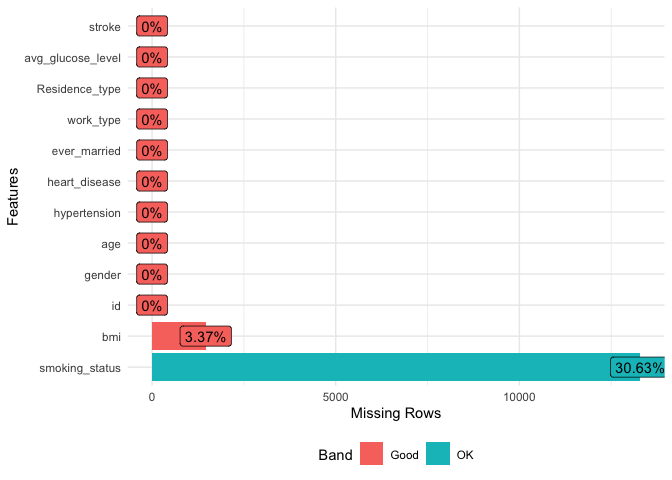<!-- -->

Smoking is a known risk factor for stroke. Since smoking is a konow
factor I will exclude patients with unknow status from this analysis as
it could be confounding factor in the analysis. The number of missing
value for this parameter is high wich is a concern for the analysis. BMI
is another know known risk factor so the ammount of missing value is
alose a concern.

``` r
# Strategy for missing values
df <- df %>% filter(!is.na(smoking_status)) # Exclude from the analysis patient with unknown smoking status
```

``` r
df <- df %>% mutate(bmi = ifelse(is.na(bmi), median(bmi, na.rm=TRUE), bmi)) # replace missing bmi value by the median of the bmi
```

Only a few observation are labelled as others and I have no information
on these patients so I will exclude them for the reamining of the
analysis.

``` r
df <- df %>% filter(gender == 'Male' | gender == 'Female') # 
```

``` r
df$id <- NULL # Remove the ID column

df <- df %>%
    mutate(
        stroke = ifelse(stroke == 0, 'no stroke', 'stroke'),
        hypertension = ifelse(hypertension == 0, 'no hypertension', 'hypertension'),
        heart_disease  = ifelse(heart_disease == 0, 'no heart disease', 'heart disease')
        )

# Trasnfrom categorical variable as factor
df$stroke <- as.factor(df$stroke)
df$gender <-  as.factor(df$gender)
df$ever_married <- as.factor(df$ever_married)
df$work_type <- as.factor(df$work_type)
df$Residence_type <- as.factor(df$Residence_type)
df$smoking_status <- as.factor(df$smoking_status)
df$hypertension <- as.factor(df$hypertension)
df$heart_disease <- as.factor(df$heart_disease)
```

## How many patients have stroke?

``` r
total_observation <- nrow(df)
df %>%
    group_by(stroke) %>%
    count() %>%
    mutate(proportion = n/total_observation * 100) %>%
    knitr::kable() %>%
    kable_styling(bootstrap_options = "striped", full_width = F)
```

<table class="table table-striped" style="width: auto !important; margin-left: auto; margin-right: auto;">

<thead>

<tr>

<th style="text-align:left;">

stroke

</th>

<th style="text-align:right;">

n

</th>

<th style="text-align:right;">

proportion

</th>

</tr>

</thead>

<tbody>

<tr>

<td style="text-align:left;">

no stroke

</td>

<td style="text-align:right;">

29461

</td>

<td style="text-align:right;">

97.880328

</td>

</tr>

<tr>

<td style="text-align:left;">

stroke

</td>

<td style="text-align:right;">

638

</td>

<td style="text-align:right;">

2.119672

</td>

</tr>

</tbody>

</table>

As common with disease related data thre is a clear unbalance between
disease and non disease patient wich is an issue for machine lerning
methods. I will use a strategy of oversampling to deal with his issue.

## Are the gender balanced?

``` r
# Calculate the table of gender repartition by disease status
total_observation <- nrow(df)
t1 <- df %>%
    group_by(gender, stroke) %>%
    count() %>%
    mutate(
        percentage = n/total_observation * 100)
```

``` r
# Summarize the age per gender and disease status
t2 <- df %>%
    group_by(gender, stroke) %>%
    summarise(
        age_mean = mean(age),
        age_sd = sd(age),
        n = n()
    )
```

    ## `summarise()` has grouped output by 'gender'. You can override using the `.groups` argument.

``` r
t3 <- inner_join(t1, t2)
t3 %>% 
    knitr::kable() %>%
    kable_styling(bootstrap_options = "striped", full_width = F)
```

<table class="table table-striped" style="width: auto !important; margin-left: auto; margin-right: auto;">

<thead>

<tr>

<th style="text-align:left;">

gender

</th>

<th style="text-align:left;">

stroke

</th>

<th style="text-align:right;">

n

</th>

<th style="text-align:right;">

percentage

</th>

<th style="text-align:right;">

age\_mean

</th>

<th style="text-align:right;">

age\_sd

</th>

</tr>

</thead>

<tbody>

<tr>

<td style="text-align:left;">

Female

</td>

<td style="text-align:left;">

no stroke

</td>

<td style="text-align:right;">

18006

</td>

<td style="text-align:right;">

59.8225855

</td>

<td style="text-align:right;">

46.88893

</td>

<td style="text-align:right;">

18.57789

</td>

</tr>

<tr>

<td style="text-align:left;">

Female

</td>

<td style="text-align:left;">

stroke

</td>

<td style="text-align:right;">

360

</td>

<td style="text-align:right;">

1.1960530

</td>

<td style="text-align:right;">

68.59444

</td>

<td style="text-align:right;">

12.21429

</td>

</tr>

<tr>

<td style="text-align:left;">

Male

</td>

<td style="text-align:left;">

no stroke

</td>

<td style="text-align:right;">

11455

</td>

<td style="text-align:right;">

38.0577428

</td>

<td style="text-align:right;">

48.45840

</td>

<td style="text-align:right;">

18.66669

</td>

</tr>

<tr>

<td style="text-align:left;">

Male

</td>

<td style="text-align:left;">

stroke

</td>

<td style="text-align:right;">

278

</td>

<td style="text-align:right;">

0.9236187

</td>

<td style="text-align:right;">

67.93165

</td>

<td style="text-align:right;">

11.35952

</td>

</tr>

</tbody>

</table>

The proportion of disease per gender and age group is balanced.

## Visualize Data Distribution

``` r
glue("{ncol(df)} variables and {nrow(df)} observatoins")
```

    ## 11 variables and 30099 observatoins

``` r
glue("Variable names:")
```

    ## Variable names:

``` r
glue("{colnames(df)}")
```

    ## gender
    ## age
    ## hypertension
    ## heart_disease
    ## ever_married
    ## work_type
    ## Residence_type
    ## avg_glucose_level
    ## bmi
    ## smoking_status
    ## stroke

``` r
categorical_data <- c("gender", "hypertension", "heart_disease", "ever_married", "work_type", "Residence_type", "smoking_status", "stroke")
plot_bar(df[categorical_data], ggtheme = theme_minimal())
```

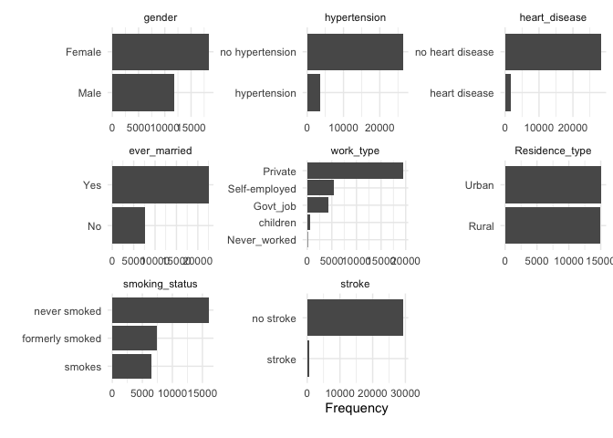<!-- -->

``` r
continous_data <- c("age", "avg_glucose_level", "bmi")
plot_density(df[continous_data], ggtheme = theme_minimal())
```

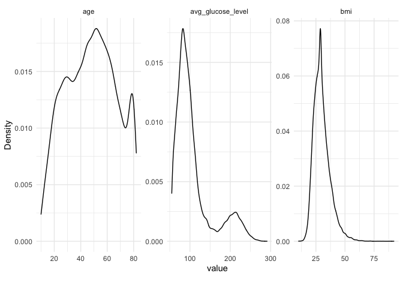<!-- -->

``` r
plot_qq(df[continous_data], ggtheme = theme_minimal(), sampled_rows = 100L)
```

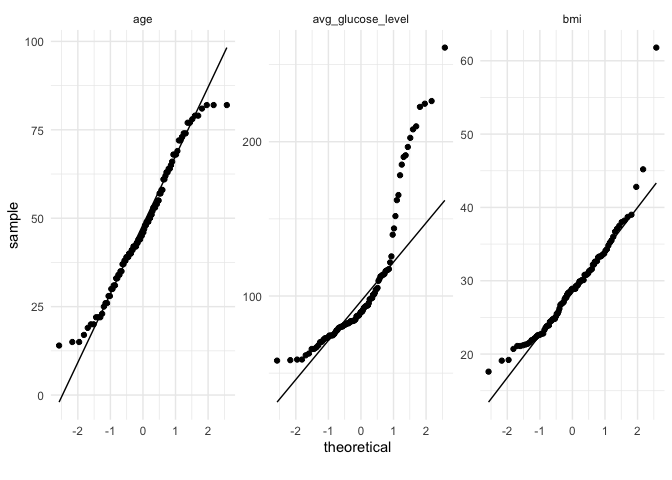<!-- -->

``` r
df <- df %>% mutate(bmi = log(bmi))
# plot_density(df[c('bmi')], ggtheme = theme_minimal())
plot_qq(df[c('bmi')], ggtheme = theme_minimal(), sampled_rows = 100L)
```

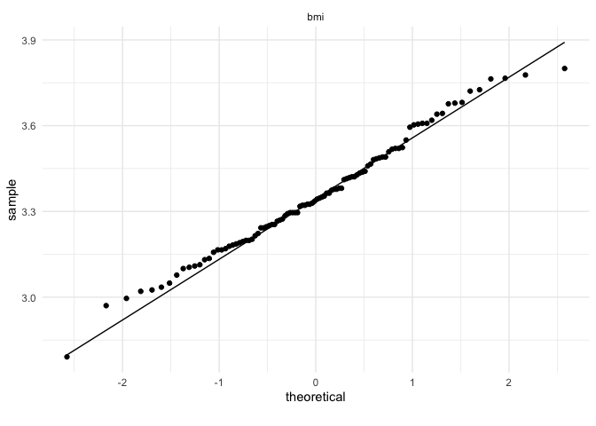<!-- -->

The bmi distribution is right skewed wich can be solve by a log
transformation.  
Average glucose level is bomodal and could potentialy be transformed as
a categorical variable.

## Solving Sampling Issue: ROSE

See [Lunardon, N., Menardi, G., and Torelli, N. (2014). ROSE: a Package
for Binary Imbalanced Learning. R
Journal, 6:82–92.](https://journal.r-project.org/archive/2014-1/menardi-lunardon-torelli.pdf)

``` r
# Over sample the data so stroke represent 50% of the total case.
data_oversampled <- ovun.sample(stroke ~ ., data = df, method = "over", N = 58940) # Increase the amount of stroke observation until it reach 29470, 58940 total observation
df_rose <- data_oversampled$data
# table(df_rose$stroke)
```

# FAMD: Factor Analysis of Mixed Data in R

See the
[website](http://www.sthda.com/english/articles/31-principal-component-methods-in-r-practical-guide/115-famd-factor-analysis-of-mixed-data-in-r-essentials/)
of the factoextra package creator: Dr. Alboukadel Kassambara.

``` r
res.famd <- FAMD(df_rose, graph = FALSE)
```

``` r
p1 <- fviz_screeplot(res.famd)
ggsave('Output/PCA/scree_plot.png', p1)
```

``` r
# Plot of variables
p1 <- fviz_famd_var(res.famd, repel = TRUE)
# Contribution to the first dimension
p2 <- fviz_contrib(res.famd, "var", axes = 1)
# Contribution to the second dimension
p3 <- fviz_contrib(res.famd, "var", axes = 2)

ggsave('Output/PCA/variables_FAMD.png', p1)

p4 <- (p2 / p3)
ggsave('Output/PCA/contribution_of_variables.png', p4)
```

From this dimension reduction it appears that age, stroke and marrital
status contribute the most to the dimension 1 smoking status, gender,
work tupe and bmi contribute the mist to the dimesnion 2

``` r
# quanti.var <- get_famd_var(res.famd, "quanti.var")
# quanti.var 
```

``` r
p1 <- fviz_famd_var(res.famd, "quanti.var", col.var = "contrib", 
             gradient.cols = c("#00AFBB", "#E7B800", "#FC4E07"),
             repel = TRUE)
p1
```

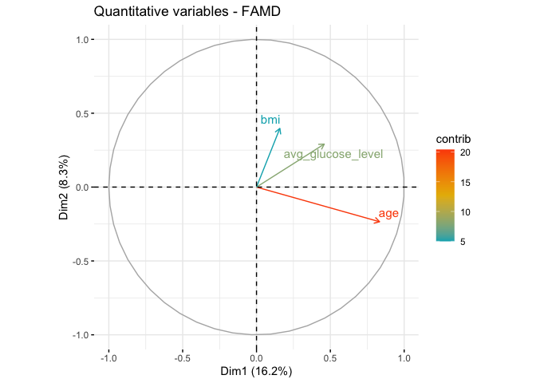<!-- -->

``` r
ggsave('Output/PCA/quantitative_variables.png', p1)
```

``` r
quali.var <- get_famd_var(res.famd, "quali.var")
```

``` r
p1 <- fviz_famd_var(res.famd, "quali.var", col.var = "contrib",
             gradient.cols = c("#00AFBB", "#E7B800", "#FC4E07"),
             repel = TRUE
             )
p1
```

<!-- -->

``` r
ggsave('Output/PCA/qualitative_variables.png', p1)
```

``` r
p1 <- fviz_mfa_ind(res.famd, 
             habillage = "stroke", # color by groups
             geom = c('point'),
             palette = pal_simpsons("springfield", alpha = 0.6)(16),
             title = "Stroke Status"
             ) 
p1
```

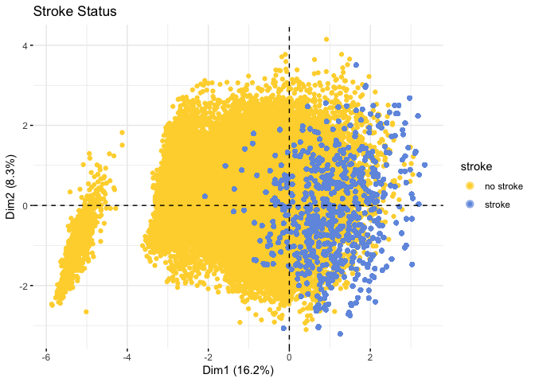<!-- -->

``` r
ggsave('Output/PCA/stroke_FAMD.png', p1)
```

``` r
p2 <- fviz_mfa_ind(res.famd, 
             habillage = "smoking_status", # color by groups
             geom = c('point'),
             palette = pal_simpsons("springfield", alpha = 0.6)(16),
             title = "Smoking Status"
             ) 
ggsave('Output/PCA/smoking_status_FAMD.png', p2)
```

``` r
p3 <- fviz_mfa_ind(res.famd, 
             habillage = "ever_married", # color by groups
             geom = c('point'),
             palette = pal_simpsons("springfield", alpha = 0.6)(16),
             title = "Martial Status"
             ) 
ggsave('Output/PCA/ever_married_FAMD.png', p3)
```

``` r
p4 <- fviz_mfa_ind(res.famd, 
             habillage = "work_type", # color by groups
             geom = c('point'), 
             palette = pal_simpsons("springfield", alpha = 0.6)(16),
             title = "Work Status"
             ) 
ggsave('Output/PCA/work_type_FAMD.png', p4)
```

``` r
p5 <- fviz_mfa_ind(res.famd, 
             habillage = "Residence_type", # color by groups
             geom = c('point'), # rempove labels
             palette = pal_simpsons("springfield", alpha = 0.6)(16), # use a color blind friendly palette 
             title = "Residence type"
             ) 
ggsave('Output/PCA/work_type_FAMD.png', p5)
```

``` r
p6 <- fviz_mfa_ind(res.famd, 
             habillage = "heart_disease", # color by groups
             geom = c('point'), 
             palette = pal_simpsons("springfield", alpha = 0.6)(16),
             title = "Heart Disease Status"
             )
ggsave('Output/PCA/heart_disease_FAMD.png', p6)
```

``` r
p7 <- fviz_mfa_ind(res.famd, 
            habillage = "hypertension", # color by groups
            geom = c('point'),
            palette = pal_simpsons("springfield", alpha = 0.6)(16),
            title = "Hypertension Status"
             )
ggsave('Output/PCA/hypertension_FAMD.png', p7)
```

``` r
all_FAMD <- (p2 + p3) / (p4 + p5) / (p6 + p7)
ggsave('Output/PCA/all_FAMD.png', all_FAMD)
all_FAMD
```

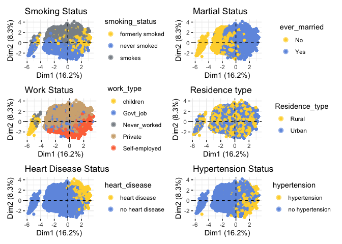<!-- -->

``` r
p1 <- df_rose %>%
    ggplot(aes(y = stroke, x = age, fill = stroke)) +
    geom_boxplot(notch = TRUE) +     
    scale_fill_manual(values=cbPalette) +
    theme_bw() +
    guides(fill=FALSE) +
    ylab('') +
    ggtitle('Transformed dataset')

p2 <- df %>%
    ggplot(aes(y = stroke, x = age, fill = stroke)) +
    geom_boxplot(notch = TRUE) +     
    scale_fill_manual(values=cbPalette) +
    theme_bw() +
    guides(fill=FALSE) +
    ylab('') +
    ggtitle('Original dataset')

p3 <- p1 | p2
p3
```

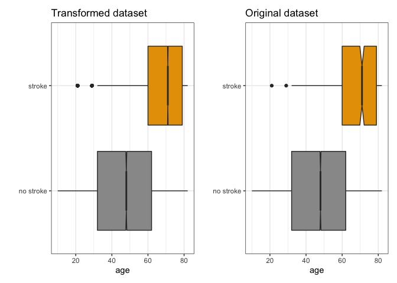<!-- -->

``` r
ggsave('Output/Independent_variables/stroke_vs_age.png', p3)

age_summary <- df %>%
    group_by(stroke) %>%
    summarise(
        mean = mean(age),
        sd = sd(age),
        n = n()
    )
```

``` r
p1 <- df_rose %>%
    ggplot(aes(y = stroke, x = avg_glucose_level, fill = stroke)) +
    geom_boxplot(notch = TRUE) +     
    scale_fill_manual(values=cbPalette) +
    theme_bw() +
    guides(fill=FALSE) +
    ylab('') +
    xlab('Glucose Level') +
    ggtitle('Transformed dataset')


p2 <- df %>%
    ggplot(aes(y = stroke, x = avg_glucose_level, fill = stroke)) +
    geom_boxplot(notch = TRUE) +     
    scale_fill_manual(values=cbPalette) +
    theme_bw() +
    guides(fill=FALSE) +
    ylab('') +
    xlab('Glucose Level') +
    ggtitle('Original dataset')

p3 <- p1 | p2
p3
```

<!-- -->

``` r
ggsave('Output/Independent_variables/stroke_vs_avg_glucose_level.png', p3)

avg_glucose_level_summary <- df %>%
    group_by(stroke) %>%
    summarise(
        mean = mean(avg_glucose_level),
        sd = sd(avg_glucose_level),
        n = n()
    )
```

``` r
p1 <- df_rose %>%
    ggplot(aes(x = gender, fill = stroke)) +
    geom_bar(position = 'fill') +
    scale_fill_manual(values=cbPalette) +
    theme_bw() +
    xlab('Gender') +
    ggtitle('Transformed dataset')

p2 <- df %>%
    ggplot(aes(x = gender, fill = stroke)) +
    geom_bar(position = 'fill') +
    scale_fill_manual(values=cbPalette) +
    theme_bw() +
    xlab('Gender') +
    ggtitle('Original dataset')

p3 <- p1 | p2
p3
```

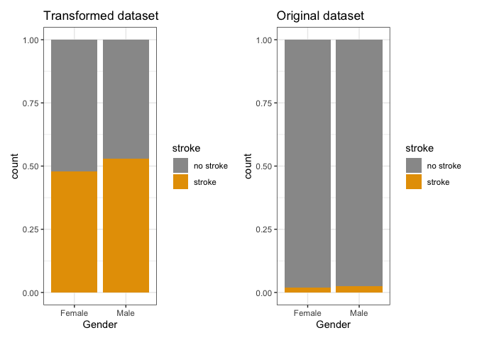<!-- -->

``` r
ggsave('Output/Independent_variables/stroke_vs_gender.png', p3)
```

``` r
p1 <- df_rose %>%
    ggplot(aes(x = ever_married, fill = stroke)) +
    geom_bar(position = 'fill') +
    scale_fill_manual(values=cbPalette) +
    theme_bw() +
    xlab('Ever Married') +
    ggtitle('Transformed dataset')

p2 <- df %>%
    ggplot(aes(x = ever_married, fill = stroke)) +
    geom_bar(position = 'fill') +
    scale_fill_manual(values=cbPalette) +
    theme_bw() +
    xlab('Ever Married') +
    ggtitle('Original dataset')

p3 <- p1 | p2
p3
```

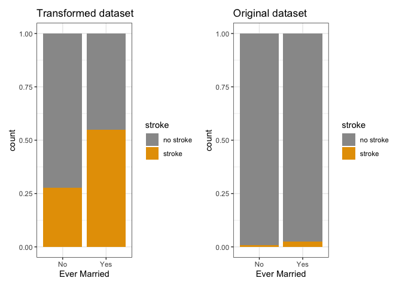<!-- -->

``` r
ggsave('Output/Independent_variables/stroke_vs_ever_married.png', p3)
```

``` r
p1 <- df_rose %>%
    ggplot(aes(y = ever_married, x = age, fill = ever_married)) +
    geom_boxplot(notch = TRUE) +     
    scale_fill_manual(values=cbPalette) +
    theme_bw() +
    guides(fill=FALSE) +
    ylab('Ever Married') +
    xlab('Age') +
    ggtitle('Transformed dataset')


p2 <- df %>%
    ggplot(aes(y = ever_married, x = age, fill = ever_married)) +
    geom_boxplot(notch = TRUE) +     
    scale_fill_manual(values=cbPalette) +
    theme_bw() +
    guides(fill=FALSE) +
    ylab('Ever Married') +
    xlab('Age') +
    ggtitle('Original dataset')

p3 <- p1 | p2
p3
```

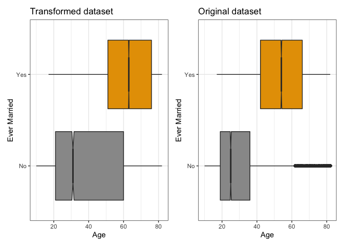<!-- -->

``` r
ggsave('Output/Independent_variables/stroke_vs_age.png', p3)

age_summary <- df %>%
    group_by(ever_married) %>%
    summarise(
        mean = mean(age),
        sd = sd(age),
        n = n()
    )
```

The impact of the marital status is likely a confunding factor due of
the age difference.

``` r
p1 <- df_rose %>%
    ggplot(aes(x = smoking_status, fill = stroke)) +
    geom_bar(position = 'fill') +
    scale_fill_manual(values=cbPalette) +
    theme_bw() +
    xlab('Smoking Status') +
    theme(axis.text.x = element_text(angle = 45, hjust = 1)) +
    ggtitle('Transformed dataset')

p2 <- df %>%
    ggplot(aes(x = smoking_status, fill = stroke)) +
    geom_bar(position = 'fill') +
    scale_fill_manual(values=cbPalette) +
    theme_bw() +
    xlab('Smoking Status') +
    theme(axis.text.x = element_text(angle = 45, hjust = 1)) +
    ggtitle('Original dataset')

p3 <- p1 | p2
p3
```

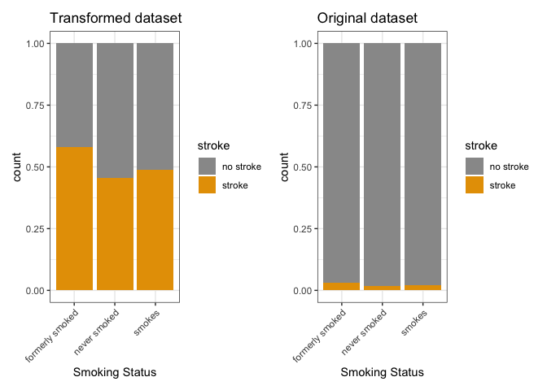<!-- -->

``` r
ggsave('Output/Independent_variables/stroke_vs_smoking_status.png', p3)
```

``` r
p1 <- df_rose %>%
    ggplot(aes(y = smoking_status, x = age, fill = smoking_status)) +
    geom_boxplot(notch = TRUE) +     
    scale_fill_manual(values=cbPalette) +
    theme_bw() +
    guides(fill=FALSE) +
    ylab('Smoking Status') +
    xlab('Age') +
    ggtitle('Transformed dataset')


p2 <- df %>%
    ggplot(aes(y = smoking_status, x = age, fill = smoking_status)) +
    geom_boxplot(notch = TRUE) +     
    scale_fill_manual(values=cbPalette) +
    theme_bw() +
    guides(fill=FALSE) +
      ylab('Smoking Status') +
    xlab('Age') +
    ggtitle('Original dataset')

p3 <- p1 | p2
p3
```

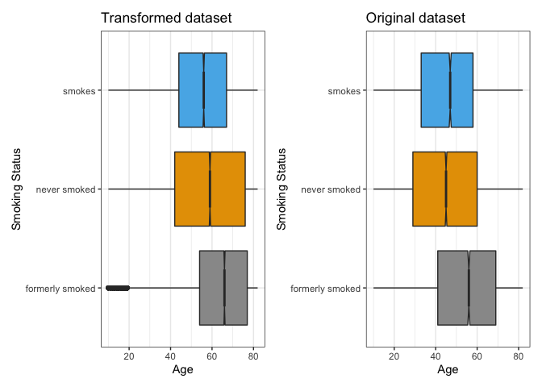<!-- -->

``` r
ggsave('Output/Independent_variables/stroke_vs_age.png', p3)

age_summary <- df %>%
    group_by(ever_married) %>%
    summarise(
        mean = mean(age),
        sd = sd(age),
        n = n()
    )
```

Surprinsingly the subset who formerly snoked have an higher proportion
of stroke. Having a look at the age distribution indicate that this
could be caused by the fact that in this group subset who formerly
skoked significantly older than the subject who smoke. To access the
impact of every paramter in the study it is therefore important to
randomize the age of the subsets.

``` r
p1 <- df_rose %>%
    mutate(Ever_Smoked = ifelse((smoking_status == 'smokes' | smoking_status == 'formerly smoked'), 'Yes', 'No'))  %>%
    ggplot(aes(x = Ever_Smoked, fill = stroke)) +
    geom_bar(position = 'fill') +
    scale_fill_manual(values=cbPalette) +
    theme_bw() +
    xlab('Ever Smoked') +
    theme(axis.text.x = element_text(angle = 45, hjust = 1)) +
    ggtitle('Transformed dataset')

p2 <- df %>%
    mutate(Ever_Smoked = ifelse((smoking_status == 'smokes' | smoking_status == 'formerly smoked'), 'Yes', 'No'))  %>%
    ggplot(aes(x = Ever_Smoked, fill = stroke)) +
    geom_bar(position = 'fill') +
    scale_fill_manual(values=cbPalette) +
    theme_bw() +
    xlab('Ever Smoked') +
    theme(axis.text.x = element_text(angle = 45, hjust = 1)) +
    ggtitle('Original dataset')

p3 <- p1 | p2
p3
```

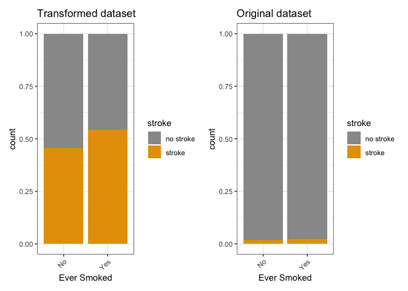<!-- -->

``` r
ggsave('Output/Independent_variables/stroke_vs_ever_smoked.png', p3)
```

``` r
p1 <- df_rose %>%
    ggplot(aes(x = hypertension, fill = stroke)) +
    geom_bar(position = 'fill') +
    scale_fill_manual(values=cbPalette) +
    theme_bw() +
    xlab('Hypertension') +
    theme(axis.text.x = element_text(angle = 45, hjust = 1)) +
    ggtitle('Transformed dataset')

p2 <- df %>%
    ggplot(aes(x = hypertension, fill = stroke)) +
    geom_bar(position = 'fill') +
    scale_fill_manual(values=cbPalette) +
    theme_bw() +
    xlab('Hypertension') +
    theme(axis.text.x = element_text(angle = 45, hjust = 1)) +
    ggtitle('Original dataset')

p3 <- p1 | p2
p3
```

<!-- -->

``` r
ggsave('Output/Independent_variables/stroke_vs_hypertension.png', p3)
```

``` r
glimpse(df_rose)
```

    ## Rows: 58,940
    ## Columns: 11
    ## $ gender            <fct> Male, Female, Female, Female, Female, Female, Male,…
    ## $ age               <dbl> 58, 70, 52, 75, 32, 74, 79, 37, 37, 40, 35, 20, 42,…
    ## $ hypertension      <fct> hypertension, no hypertension, no hypertension, no …
    ## $ heart_disease     <fct> no heart disease, no heart disease, no heart diseas…
    ## $ ever_married      <fct> Yes, Yes, Yes, Yes, Yes, Yes, Yes, Yes, Yes, Yes, N…
    ## $ work_type         <fct> Private, Private, Private, Self-employed, Private, …
    ## $ Residence_type    <fct> Urban, Rural, Urban, Rural, Rural, Urban, Urban, Ru…
    ## $ avg_glucose_level <dbl> 87.96, 69.04, 77.59, 243.53, 77.67, 205.84, 57.08, …
    ## $ bmi               <dbl> 3.668677, 3.580737, 2.873565, 3.295837, 3.475067, 4…
    ## $ smoking_status    <fct> never smoked, formerly smoked, formerly smoked, nev…
    ## $ stroke            <fct> no stroke, no stroke, no stroke, no stroke, no stro…

``` r
p1 <- df_rose %>%
    ggplot(aes(y = hypertension, x = age, fill = hypertension)) +
    geom_boxplot(notch = TRUE) +     
    scale_fill_manual(values=cbPalette) +
    theme_bw() +
    guides(fill=FALSE) +
    ylab('') +
    xlab('Age') +
    ggtitle('Transformed dataset')


p2 <- df %>%
    ggplot(aes(y = hypertension, x = age, fill = hypertension)) +
    geom_boxplot(notch = TRUE) +     
    scale_fill_manual(values=cbPalette) +
    theme_bw() +
    guides(fill=FALSE) +
    ylab('') +
    xlab('Age') +
    ggtitle('Original dataset')

p3 <- p1 | p2
p3
```

<!-- -->

``` r
ggsave('Output/Independent_variables/hypertension_vs_age.png', p3)
```

``` r
p1 <- df_rose %>%
    ggplot(aes(x = heart_disease, fill = stroke)) +
    geom_bar(position = 'fill') +
    scale_fill_manual(values=cbPalette) +
    theme_bw() +
    xlab('Hypertension') +
    theme(axis.text.x = element_text(angle = 45, hjust = 1)) +
    ggtitle('Transformed dataset')

p2 <- df %>%
    ggplot(aes(x = heart_disease, fill = stroke)) +
    geom_bar(position = 'fill') +
    scale_fill_manual(values=cbPalette) +
    theme_bw() +
    xlab('Hypertension') +
    theme(axis.text.x = element_text(angle = 45, hjust = 1)) +
    ggtitle('Original dataset')

p3 <- p1 | p2
p3
```

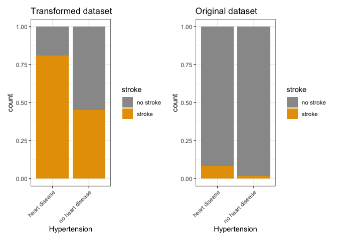<!-- -->

``` r
ggsave('Output/Independent_variables/stroke_vs_heart_disease.png', p3)
```

From the unsupervised learning is seems that the most likely associated
features for a risk of developping a storke are:

  - Age
  - Gender
  - Average Glucose Level
  - Ever Smoked
  - Hypertension
  - Heart Disease

# Find variable associated with stroke: Logistic regression

There is many good explanation of logistic regression but my favorite
are from [Josh Starmer](https://github.com/StatQuest) and DataCamp
Instructor [Brett
Lantz](https://www.amazon.co.uk/Machine-Learning-R-Brett-Lantz/dp/1782162143).

``` r
df_selected <- df_rose %>%
    mutate(ever_smoked = ifelse((smoking_status == 'smokes' | smoking_status == 'formerly smoked'), 'Yes', 'No'))

df_selected <- df_selected %>% 
       select(age, gender, avg_glucose_level, ever_smoked, hypertension, heart_disease, stroke)

df_selected$ever_smoked <- as.factor(df_selected$ever_smoked)
```

``` r
df_selected_features <- df_selected %>% select(-stroke) %>% mutate_if(is.factor, as.numeric) # Recode all categorical data to numeric
df_selected_target <- df_selected %>% select(stroke) 

df_selected <- bind_cols(df_selected_features, df_selected_target)

levels(df_selected$stroke)
```

    ## [1] "no stroke" "stroke"

``` r
model <- glm(stroke ~ age + gender + avg_glucose_level + ever_smoked + hypertension + heart_disease, data = df_selected, family = binomial)
# exp(coef(model))
summary(model)
```

    ## 
    ## Call:
    ## glm(formula = stroke ~ age + gender + avg_glucose_level + ever_smoked + 
    ##     hypertension + heart_disease, family = binomial, data = df_selected)
    ## 
    ## Deviance Residuals: 
    ##     Min       1Q   Median       3Q      Max  
    ## -2.5480  -0.7748   0.2873   0.7774   2.6042  
    ## 
    ## Coefficients:
    ##                     Estimate Std. Error z value Pr(>|z|)    
    ## (Intercept)       -3.2595792  0.1118086 -29.153   <2e-16 ***
    ## age                0.0747710  0.0007302 102.396   <2e-16 ***
    ## gender             0.0169540  0.0210582   0.805    0.421    
    ## avg_glucose_level  0.0036556  0.0001889  19.355   <2e-16 ***
    ## ever_smoked        0.2618589  0.0207796  12.602   <2e-16 ***
    ## hypertension      -0.4442132  0.0257698 -17.238   <2e-16 ***
    ## heart_disease     -0.6605769  0.0328377 -20.116   <2e-16 ***
    ## ---
    ## Signif. codes:  0 '***' 0.001 '**' 0.01 '*' 0.05 '.' 0.1 ' ' 1
    ## 
    ## (Dispersion parameter for binomial family taken to be 1)
    ## 
    ##     Null deviance: 81708  on 58939  degrees of freedom
    ## Residual deviance: 58867  on 58933  degrees of freedom
    ## AIC: 58881
    ## 
    ## Number of Fisher Scoring iterations: 4

The deviances residual is centered on 0 and symetrical wich indicate
that the model is likely accurate. The p values are significants for the
most of the selected variable but gender. This not entirely surprising
as the differences for gender were tiny on the bar plot.

``` r
## Now calculate the overall "Pseudo R-squared" and its p-value
ll.null <- model$null.deviance/-2
ll.proposed <- model$deviance/-2
 
## McFadden's Pseudo R^2 = [ LL(Null) - LL(Proposed) ] / LL(Null)
glue("McFadden's Pseudo R^2: {(ll.null - ll.proposed) / ll.null}")
```

    ## McFadden's Pseudo R^2: 0.279541673020032

``` r
## The p-value for the R^2
glue("R^2 p-value: {1 - pchisq(2*(ll.proposed - ll.null), df=(length(model$coefficients)-1))}")
```

    ## R^2 p-value: 0

A McFadden’s Pseudo R^2 between 0.2 and 0.4 is considered a good fit.
Since the p-value is inferior to p=0.05 we reject the null hypothesis
and consider the R^2 score significant.

``` r
predicted.data <- data.frame(
  probability.of.stroke=model$fitted.values,
  stroke=df_selected$stroke)
```

``` r
predicted.data <- predicted.data[
  order(predicted.data$probability.of.stroke, decreasing=FALSE),]
predicted.data$rank <- 1:nrow(predicted.data)
```

``` r
p1 <- ggplot(data=predicted.data, aes(x=rank, y=probability.of.stroke)) +
  geom_point(aes(color=stroke), alpha=1, shape=4, stroke=2) +
  scale_colour_manual(values=cbPalette) +
  xlab("Index") +
  ylab("Predicted probability of getting a stroke") +
  theme_bw()
p1
```

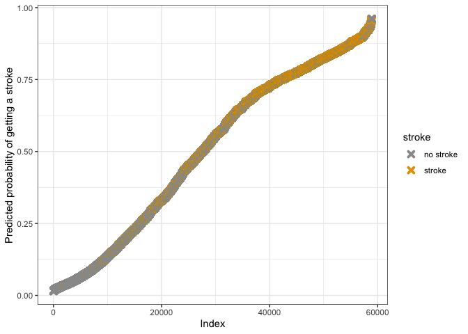<!-- -->

``` r
ggsave('Output/Logistic_regression/logisitc_regression_evaluation.png', p1)
```

This graph ilustrate that most of the the stroke subjects are correctly
callsified validation the model and therefore the identification of the
features associated to stroke risk.

``` r
# Save a plot of the 5 selected risk factors from the transformed data frame

p1 <- df_rose %>%
    ggplot(aes(y = stroke, x = age, fill = stroke)) +
    geom_boxplot(notch = TRUE) +     
    scale_fill_manual(values=cbPalette) +
    theme_bw() +
    guides(fill=FALSE) +
    xlab('Age') +
    ylab('Stroke') +
    ggtitle('Age')

p2 <- df_rose %>%
    ggplot(aes(y = stroke, x = avg_glucose_level, fill = stroke)) +
    geom_boxplot(notch = TRUE) +     
    scale_fill_manual(values=cbPalette) +
    theme_bw() +
    guides(fill=FALSE) +
    ylab('Stroke') +
    xlab('Avegrage glucose Level') +
    ggtitle('Glucose Level')

p3 <- df_rose %>%
    mutate(Ever_Smoked = ifelse((smoking_status == 'smokes' | smoking_status == 'formerly smoked'), 'Yes', 'No'))  %>%
    ggplot(aes(x = Ever_Smoked, fill = stroke)) +
    geom_bar(position = 'fill') +
    scale_fill_manual(values=cbPalette) +
    theme_bw() +
    xlab('Ever Smoked') +
    theme(axis.text.x = element_text(angle = 45, hjust = 1)) +
    ggtitle('Smoking history')

p4 <-  df_rose %>%
    ggplot(aes(x = hypertension, fill = stroke)) +
    geom_bar(position = 'fill') +
    scale_fill_manual(values=cbPalette) +
    theme_bw() +
    xlab('Hypertension') +
    theme(axis.text.x = element_text(angle = 45, hjust = 1)) +
    ggtitle('Hypertension')

p5 <- df_rose %>%
    ggplot(aes(x = heart_disease, fill = stroke)) +
    geom_bar(position = 'fill') +
    scale_fill_manual(values=cbPalette) +
    theme_bw() +
    xlab('Heart Disesae') +
    theme(axis.text.x = element_text(angle = 45, hjust = 1)) +
    ggtitle('Heart Disesae History')

p6 <- (p1 + p2) / (p3 + p4) / (p5 + plot_spacer())
ggsave('Output/Independent_variables/risks_factors.pdf', p6)
```

    ## Saving 7 x 5 in image

# Conclusion

Using dimension reduction and supervised machine learning, I was able to
identify 5 variables as the principal risk factors of developing a
stroke:

  - Age
  - Average Glucose Level
  - Ever Smoked
  - Hypertension
  - Heart Disease

This features could be used to built a machine learning model of stroke
risk using the logistic regression or random forest. Although given the
limited number of initial observations such model is more at risk to
over fit even after correction for sample unbalanced.

# References

  - [Healthcare Dataset Stroke
    Data](https://www.kaggle.com/asaumya/healthcare-dataset-stroke-data)
  - [Lunardon, N., Menardi, G., and Torelli, N. (2014). ROSE: a Package
    for Binary Imbalanced Learning. R
    Journal, 6:82–92.](https://journal.r-project.org/archive/2014-1/menardi-lunardon-torelli.pdf)
  - [FAMD - Factor Analysis of Mixed Data in R:
    Essentials](http://www.sthda.com/english/articles/31-principal-component-methods-in-r-practical-guide/115-famd-factor-analysis-of-mixed-data-in-r-essentials/)
  - [logistic\_regression\_demo](https://github.com/StatQuest/logistic_regression_demo/blob/master/logistic_regression_demo.R)
  - [Machine Learning with R - Brett
    Lantz](https://www.amazon.co.uk/Machine-Learning-techniques-predictive-modeling-ebook/dp/B07PYXX3H5/ref=sr_1_1?dchild=1&qid=1585504635&refinements=p_27%3ABrett+Lantz&s=books&sr=1-1&text=Brett+Lantz)
